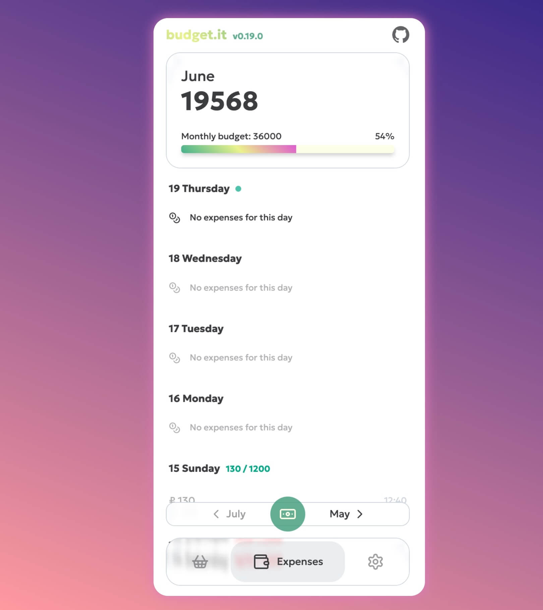

# budget.it – Another budget app, but this one is handy


A simple application for tracking the budget for each day




## Features

- Daily budget tracking
- Monthly budget tracking
- Automatic calendar generating
- Last 6 month history
- Currencies setup
- Daily budget setup
- Shopping List
- PWA available
- Import/export data
- Works offline

## How data is stored?

For this moment data is stored in local storage of your browser.

## Install application on your device

### iOS

Open the following link on your iPhone or iPad: [https://begprod.github.io/budget.it/](https://begprod.github.io/budget.it/)

Push the button "Share" in the browser menu, then push the button "Add to Home Screen":


### Android

Open the following link on your Android device: [https://begprod.github.io/budget.it/](https://begprod.github.io/budget.it/)

Push the button "Add to Home screen" in the browser menu:


## For developers

### Recommended IDE Setup

[Zed](https://zed.dev/) – will automatically setup the project

#### Alternative

[VSCode](https://code.visualstudio.com/) + [Vue - Official](https://marketplace.visualstudio.com/items?itemName=Vue.volar)

### Project Setup

```sh
npm install
```

#### Compile and Hot-Reload for Development

```sh
npm run dev
```

#### Take a look other commands in `package.json`
